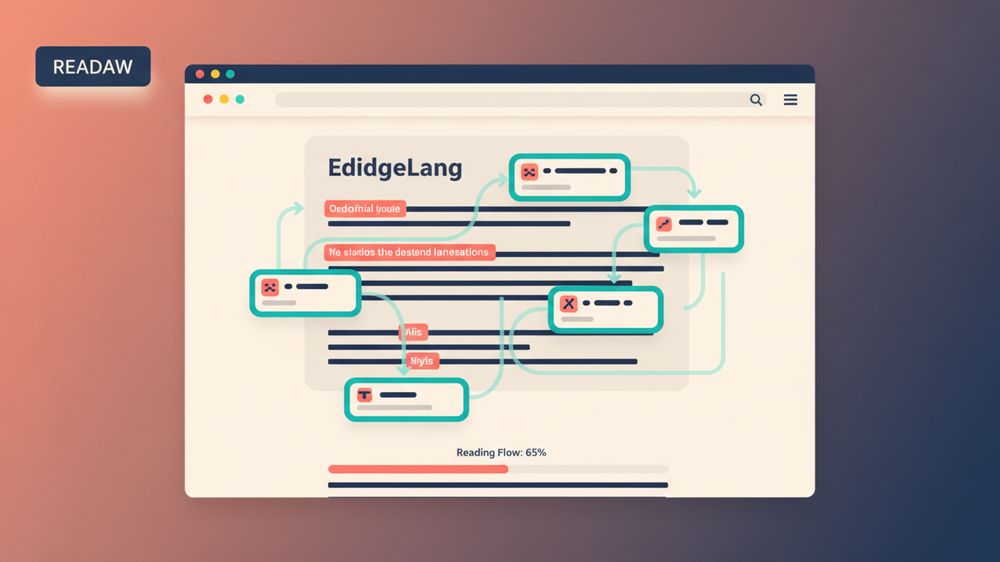

# EdgeLang: Learn Languages at the Edge of Every Page



EdgeLang is a Chrome extension that turns ordinary browsing into contextual language practice. It scans the page you are reading, identifies words and phrases close to your current level, and adds lightweight interactive cues so learning happens inside real content instead of a separate app.

The extension supports passive reading practice, active recall, multiple AI providers, progress tracking, calibration, configurable cue styling, and browser-first routing through [ModelMesh](https://modelmesh.tech/).

## Why EdgeLang

- Learn from real pages instead of artificial drills
- Switch between passive and active language practice
- Route AI requests across providers for resilience
- Keep the experience lightweight with subtle on-page augmentation
- Track progress, calibration results, streaks, and resolved vocabulary

## Quick Links

- [User Manual](docs/USER_MANUAL.md)
- [System Concepts](docs/SystemConcepts.md)
- [Software Requirements](docs/SoftwareRequirements.md)
- [Test Plan](docs/TestPlan.md)
- [ModelMesh Project](https://modelmesh.tech/)

## Installation

### Download the project

Choose one of these paths:

1. Download the latest release from the GitHub Releases page.
2. Or clone the repository:

```bash
git clone https://github.com/ApartsinProjects/edgelang.git
cd edgelang
```

### Load the extension in Chrome

1. If you downloaded a release ZIP, extract it first.
2. Open Chrome and go to `chrome://extensions`.
3. Enable `Developer mode`.
4. Click `Load unpacked`.
5. Select the [src](src) folder, not the repository root.
6. If Chrome reports a missing manifest, you selected the wrong folder.

### First-time setup

1. Click the EdgeLang toolbar icon.
2. Open `Settings`.
3. Choose your native language and target language.
4. Add at least one provider API key.
5. Validate the keys from the options page.
6. Run calibration if prompted.
7. Open a content-heavy page and wait for the processing indicator.

## How It Works

EdgeLang uses a content script to extract visible page text, a background service worker to coordinate AI analysis, and popup/options pages for controls and configuration. AI routing is handled through a local adapter layer designed around ModelMesh-style provider selection and failover.

When a page is being analyzed, the extension now exposes progress through the toolbar state and popup status so the experience is less opaque while the model is working.

## Features

- Adaptive cue generation based on the page and learner level
- Passive and active practice modes
- Site blacklist and whitelist controls
- Calibration flow with saved progress
- Provider and model selection
- API key validation
- Configurable highlight color and cue style
- Toolbar processing indicator and blocker reasons
- Progress statistics and vocabulary export

## Development

### Project structure

```text
src/
├── manifest.json
├── background.js
├── content.js
├── popup.html
├── popup.js
├── options.html
├── options.js
├── styles/
├── icons/
└── _locales/
docs/
├── USER_MANUAL.md
├── SystemConcepts.md
├── SoftwareRequirements.md
└── TestPlan.md
scripts/
└── generate_readme_banner.py
```

### Run tests

```bash
npm test
```

### Regenerate the README banner

The banner was generated with Gemini using the local environment key.

```bash
python scripts/generate_readme_banner.py
```

## Notes

- Chrome must load the unpacked extension from [src](src).
- The latest packaged source is also available from the GitHub Releases page.
- The extension needs at least one configured AI provider before it can augment pages.
- If a page shows no cues, open the popup to see the current blocker reason.

## License

MIT

## Author

Sasha Apartsin  
[www.apartsin.com](https://www.apartsin.com)
